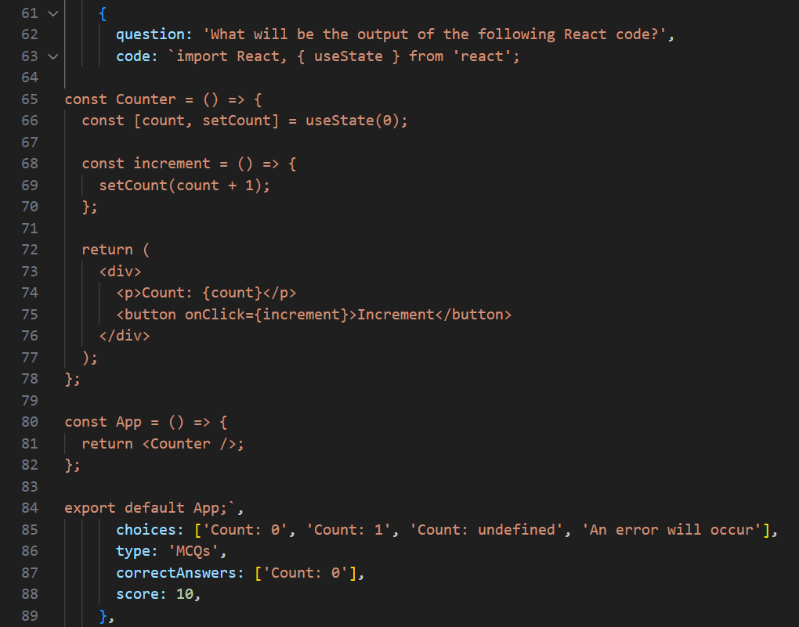

# Xeven Quiz - ReactJS Quiz App Template

With **Xeven Quiz**, you don't have to spend hours on coding from scratch. This Quiz App template provides a solid foundation, eliminating the need to reinvent the wheel. You'll spend less time developing your app, which lets you focus on the unique. 

Xeven Quiz helps you follow industry best practices and coding conventions as a beginner.

As a beginner developer, a quiz app is a common project. But without guidance, this simple project can become difficult. 

Xeven Quiz is here to change that narrative and give you the tools and knowledge you need to create a successful and efficient quiz app.

With a strong architecture and modular design, you can easily add new features, expand your question database, and accommodate a growing user base without experiencing any setbacks.

### Powerful Tech Stack

- Reactjs
- Typescript
- Styled components

With **ReactJS** at its core, it lets you design dynamic interfaces that automatically update and respond to user interactions.

**TypeScript** brings enhanced development productivity through static typing and intelligent tooling. 

**Styled Components** ensure fast and intuitive styling, allowing you to create stunning interfaces effortlessly.


## React Quiz App's Theme Features

Before I explain the technical aspects of the quiz app, let me share the wonderful features of the quiz app. You can get all these features in a template and mold them according to your choice.

- Seamlessly switch between Light and Dark modes with just a single click from the top menu.

- The user can pick a quiz topic on the first screen, like JavaScript, React, or General Knowledge.

- There will be a timer running when the quiz starts. If the timer finishes, the quiz will be stopped, and the user will be asked to see the result.

- The template also supports three types of questions, MCQs, True/False, and MAQs.

- The template allows for adding code snippets in questions. You can easily assess the users' programming knowledge and skills.

- The template allows you to create questions with images to enhance user engagement.

- Each question has a score. For example, a difficult question has 10 marks, and an easier one has 5.

- The result screen shows how many questions the user attempted, how much he scored, how long it took, and whether he passed or failed.

- In result screen user can see which question had the right answer and which was wrong. The user can find the correct answer in case of a wrong answer.

## React Quiz App's Code Features

- **TypeScript powered Components**: All components are TypeScript-built for enhanced development productivity with intelligent code completion and compile-time error checking.

- **Easy Theme Customization**: The template provides easy theme management with IntelliSense support via Styled Components and Typescript. It allows you to customize the app's appearance without relying on hard-coded colors.

- **Flexible Question Data Structure**: The template uses Javascript/TypeScript files to define quiz questions. This format provides a structured and flexible approach. The same format can also be used to fetch questions from an API if desired.

- **Modular and Context Pattern**: The template follows a javascript modular and React Context pattern, promoting component reusability and maintainability.

- **Custom Hooks for Logic Sharing**: The hook pattern lets you share logic across components. It also promotes code reuse and minimizes code clutter.

- **Built with React Best Practices**: App follows industry-leading React practices. Our template ensures optimal structure, scalability, and maintainability.


## Xeven Quiz - ReactJS Quiz App Template Code Documentations

This guide will walk you through the steps to start using and customizing the app according to your needs. The Xeven Quiz is designed to help you create interactive quizzes with various question types, including Multiple Choice Questions (MCQs), Multiple Answer Questions (MAQs), and True/False questions.

## Demo App

To experience the Demo App, visit the link: https://xeven-quiz.vercel.app/

## **How to Start a Project**

To start the project, follow these steps:

1. Clone the repo and navigate to the project directory via terminal.
2. Run the command **`npm install`** to download and install all the project dependencies.
3. Once the dependencies are installed, run the command **`npm start`** to start the development server.

### Folder Structure Explanation

Understanding the folder structure is essential for working with the app. Here's an overview of the main folders:


- **assets**: Contains all the app's assets, such as fonts, icons, and images
- **components**: Contains all the components of app
- **components/UI**: Contains reusable UI components of app
- **context**: Includes a context for sharing logic across the app
- **styles**: Contains styles and their configurations using Styled Components
- **hooks**: Includes reusable hooks used in the app
- **utils**: Contains Javascript helper functions
- **data**: Contains quiz questions and quiz topic screens data
- **types**: Contains TypeScript types used throughout the app
- **config**: Imports all the icons, providing centralized access

### Components Architecture

The **Xeven Quiz App** consists of 5 main screens/components that are displayed conditionally:

1. Splash Screen
2. Quiz Topics Screen
3. Quiz Details Screen
4. Questions Screen
5. Result Screen

The screens are organized in the **`components`** folder since the app does not utilize routing. If a component is reusable and can be used in multiple places within the app (e.g., Button, ModalWrapper, and CodeSnippet), it is placed in the **`components/UI`** folder. On the other hand, if a component is screen-specific and separated just to make other components smaller and more manageable, it is placed in the relevant components folder. For example, the components `**QuizHeader**`, `**Question**`, and `**Answer**` are inside the **`QuestionScreen`** folder.

## How to customize the quiz layout and styling

### Changing the App Theme

To change the theme of the app, follow these steps:

1. Open the **`styles/Themes`** file.
2. Modify the colors in the themes to customize the app's appearance.

### Changing the App Font

To change the font of the app, follow these steps:

1. Go to **`assets`** ⇒ **`fonts`**.
2. Replace the current fonts (e.g., "anek-malayalam") with the fonts you want to use.
3. Go to **`fonts.module.css`** file ****and replace the font name and path with new font you added.
4. Go to the **`theme`** file and change the font name.
5. Go to the global styles and update the font in the **`body`** section.

### Modifying the Quiz Topic Screen or Adding New Categories

To modify the Quiz Topics Screen or add new categories of topics/icons, follow these steps:

1. Open the **`data/quizTopics`** file.
2. Make changes to the titles, icons or add new topics (by adding new object in `quizTopics`) as needed.
3. Ensure that the title in the **`QuizTopic`** data match the topic of **`data/QuizQuestions`** folder.

For example

```jsx
export const quizTopics: QuizTopic[] = [
  {
    title: 'React', // match topic value with this line
    icon: <ReactIcon />,
  },
  {
    title: 'JavaScript', // match topic value with this line
    icon: <JavaScript />,
  },
  ....
]

export const javascript: Topic = {
  topic: 'Javascript', // match value with topic key
  level: 'Beginner',
  totalQuestions: 14,
  .....
}
```

### Adding a New Screen

This app is designed with scalability in mind, allowing you to easily add new screens. Here's how you can add a new screen, such as a "Quiz Types" screen (where you can select quiz type for example individual question timer, with or without timer):

**Step 1: Create a component**

Create a new component called **`QuizType`** in the **`components`** folder.

**Step 2: Update the Main component**

Go to the main components file (**`Main/index.ts`**) and render the **`QuizType`** screen in the **`screenComponents`** section/object. Don't forget to add the screen name in the typescript **`screenTypes`** as well.

```jsx
const screenComponents = {
  [ScreenTypes.SplashScreen]: <SplashScreen />,
  [ScreenTypes.QuizTopicsScreen]: <QuizTopicsScreen />,
  [ScreenTypes.QuizTypesScreen]: <QuizTypesScreen />, // new screen  
  [ScreenTypes.QuizDetailsScreen]: <QuizDetailsScreen />,
  [ScreenTypes.QuestionScreen]: <QuestionScreen />,
  [ScreenTypes.ResultScreen]: <ResultScreen />,
}
```

If you have multiple conditions to show the screen, you can change the object to a switch or if-else statement. Here's an example using a switch statement:

```jsx
import { useEffect } from 'react'

import { useQuiz } from '../../context/QuizContext'
import { ScreenTypes } from '../../types'

import QuestionScreen from '../QuestionScreen'
import QuizDetailsScreen from '../QuizDetailsScreen'
import QuizTopicsScreen from '../QuizTopicsScreen'
import ResultScreen from '../ResultScreen'
import SplashScreen from '../SplashScreen'

function Main() {
  const { currentScreen, setCurrentScreen } = useQuiz()

  useEffect(() => {
    setTimeout(() => {
      setCurrentScreen(ScreenTypes.QuizTopicsScreen)
    }, 1000)
  }, [])

  switch (currentScreen) {
    case ScreenTypes.SplashScreen:
      return <SplashScreen />
    case ScreenTypes.QuizTopicsScreen:
      return <QuizTopicsScreen />
    case ScreenTypes.QuizDetailsScreen:
      return <QuizDetailsScreen />
    case ScreenTypes.QuestionScreen:
      return <QuestionScreen />
    case ScreenTypes.ResultScreen:
      return <ResultScreen />
    default:
      return <SplashScreen />
  }
}

export default Main
```

### Adding Pictures/Images to Questions

In addition to text questions, you can also include images or pictures to enhance your questions. To add an image to a question, follow these steps:

**1. Upload the Image**

Start by placing your image file in the **`src/assets/images`** folder within your project directory.

**2. Import the Image**

Import the image in the quiz category data where you want to show it. For more details see `src/data/QuizQuestions/generalKnowledge.ts`

**3. Link the Image to Your Question**

Within your question object, add an image key. Then, reference the image you imported in step 2 at the top of your question.


### How to Add Code Snippets in Questions

Just like images, each question supports a **`code`** key, which is conditionally shown only if the question contains a code snippet.

### How to format code snippet

In the Xeven Quiz App, code snippets are pieces of code represented as text. To make them look nice and readable, we use an npm package called **`prismjs`**. This tool highlights the code with different colors so that it stands out and is easy to understand.

To display code correctly, we need to pay attention to the spaces and how the code is structured, just like we do with the existing questions. This way, the code will appear neatly formatted and will be easier for users to read and comprehend.

Here's an example image to illustrate the correct format for displaying code snippets:



### Implementing Different Types of Quiz Questions

The Code Quiz App supports various types of quiz questions, including Multiple Choice Questions (MCQs), Multiple Answer Questions (MAQs), and True/False questions. To add different question types, you can modify the question components and their associated data structures. You can refer to the existing question formats in the **`data/QuizQuestions`** folder as examples when creating new questions.

For example, if you want to create a Multiple Choice Question (MCQ), you need to set its **`type`** to **`MCQs`** in the question data. Similarly, for a Multiple Answer Question (MAQ), set the **`type`** to **`MAQs`**, and for a True/False question, set it to the appropriate type as well.

**Remember:** For MAQs, users can select multiple answer options, while for MCQs and True/False questions, users can select only one option. Make sure to set the correct **`type`** to match the question's behavior accordingly.

### Important Note

Before making the Code Quiz App your own, remember to customize the meta and title tags in the **`index.html`** file, as well as the logo, preview image, and favicon image in the **`public`** folder. This ensures that the app reflects your branding and identity.

## New Variant

Looking for a **Tailwind CSS** version? Check out GitHub Repo of [Flexy Quiz](https://github.com/AbdulBasit313/react-tailwind-quiz-app) – built with **React** and **Tailwind CSS** for a sleek and dynamic UI. Here is the [demo of Flexy Quiz](https://flexy-quiz.netlify.app/).

## Upgrade to PRO version

Discover the Premium Version! Elevate your experience with the same amazing features you have seen in [demo](https://xeven-quiz.vercel.app/) app. 

[Check it out now!](https://basit313.gumroad.com/l/react-quiz-app-template)

### Premium Version Highlights

Almost all the features I have added in this GitHub open source repo.

- Every time the quiz starts, the questions will be shuffled or randomized

- Users can skip a question if they are unsure of the answer. They can return to it later and answer it before submitting the quiz.

## **Deploying the Quiz App to a Production Environment**

To share your quiz app with the world, you need to deploy it on a server that supports single-page applications or the React ecosystem. Here are some popular options for deploying your app:

1. Digital Ocean
2. Vercel
3. Netlify
4. AWS Amplify

Choose the one that best suits your needs and follow their deployment instructions to make your app accessible to users.

### Contact Me

I hope this documentation helps you get started with the Xeven Quiz App. If you have any questions or feedback, please feel free to reach out to me at **[abdul_basit313@outlook.com](mailto:abdul_basit313@outlook.com)**. Happy quizzing!
